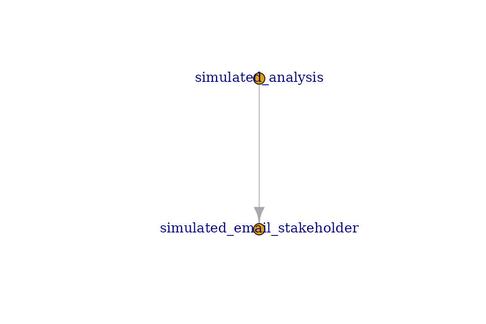
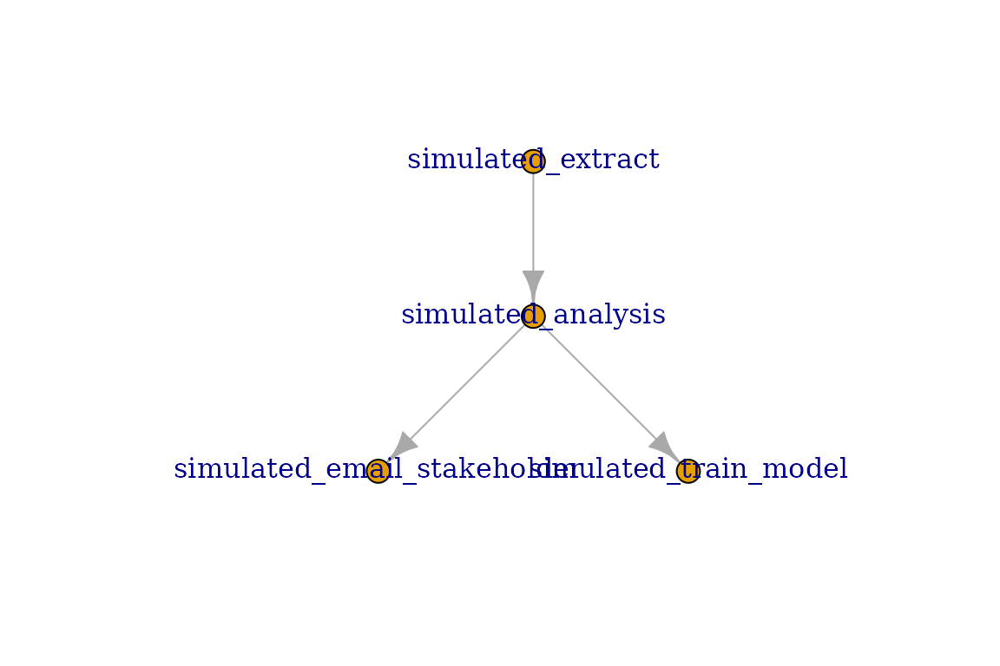
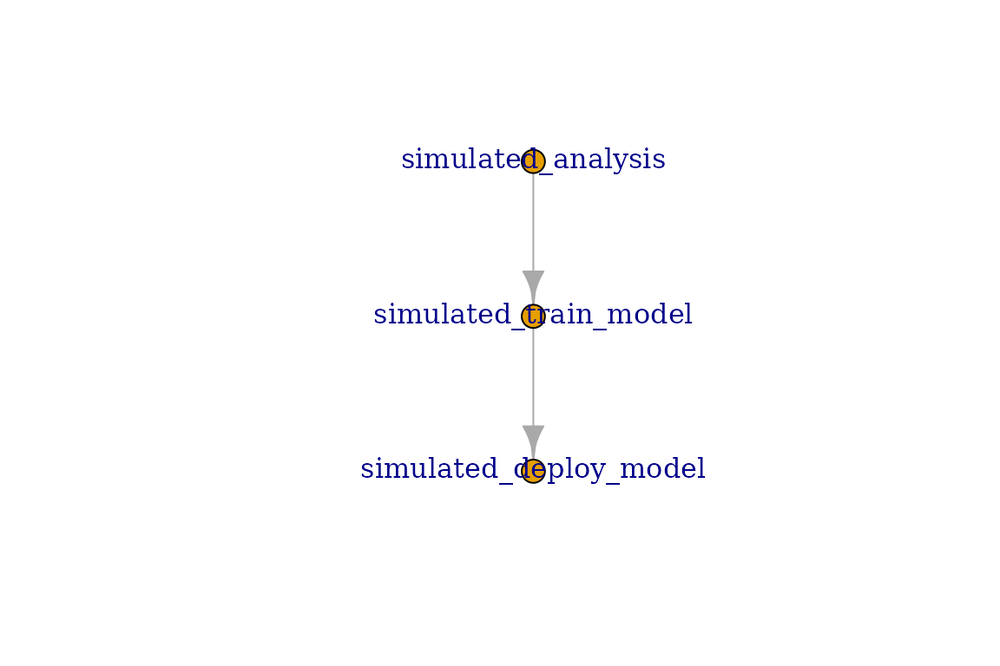
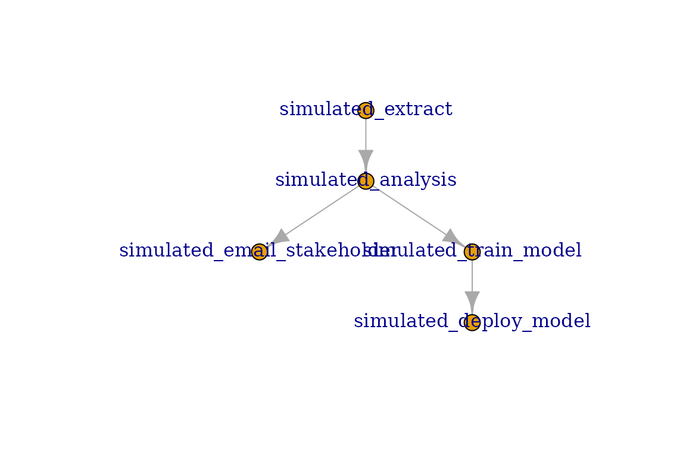
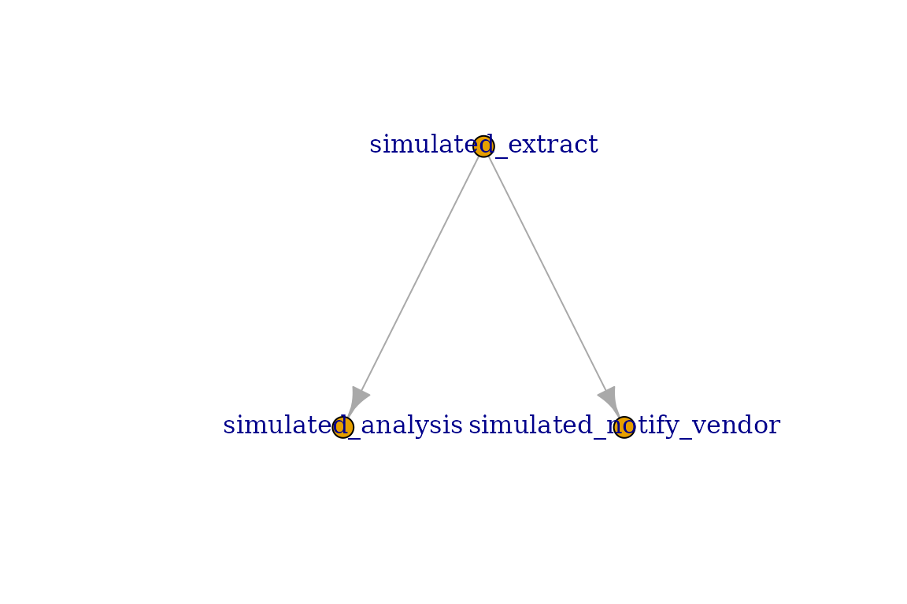

# Connect Tasks

A Connect Task is any form of content published to Posit Connect that
has the ability to be scheduled for a render. This includes content such
as:

- Rmd
- Quarto
- Jupyter Notebooks

In out-of-the-box Posit Connect, these content items may be scheduled to
run, or may be run on-command from the UI.

This package provides functionality to programmatically run these tasks
using triggers outside of the out-of-box experience. The `connectapi`
package provides the base functionality we need to achieve this goal.
This \[`connectapi.dag`\] package provides simplified wrappers around
these capabilities for the explicit purpose of orchestrating these tasks
ourselves.

## Programmatically Run Tasks

Before we jump into full orchestration, let’s start simple. Let’s start
with a single task the runs conditionally.

Normally, connect tasks are created by providing their content guid as
the first parameter to the `connect_task` function. For this walk
through, we’ll use simulated tasks instead, and give them human-friendly
names for simplicity’s sake.

``` r

library(connectapi.dag)
notify_task <- connect_task("email_stakeholder", simulated = TRUE)
```

With our task defined, we can now simply call the `task_run` function on
it to execute the task. This may be envoked from an existing job, from a
Shiny application, or from an API.

``` r

some_condition <- TRUE
if (some_condition) task_run(notify_task, verbose = TRUE)
#> Starting task email_stakeholder
#> Task Succeeded
```

## Statuses

All connect tasks have a status. They may be accessed directly:

``` r

notify_task$status
#> [1] "Succeeded"
```

There are 4 possible statuses a task may be in.

- **Pending**: Task has not run yet
- **Succeeded**: Task ran successfully without error
- **Failed**: Task encountered an error
- **Skipped**: Task did not meet criteria to run and has completed
  evaluation.

All newly created tasks start in the *Pending* status.

When a task is ran using the `task_run` function, it may stop in any of
the terminal statuses; *Succeeded*, *Failed*, or *Skipped*. Once
terminal, attempting to call the `task_run` function again will result
in an error.

In happy path, tasks will be in the *Succeeded* status after evaluation.
If an error is encountered while running the task, the task will be in
the *Failed* status. And if the preconditions for the task are not met
(defined in the `trigger_rule` parameter) then it is *Skipped*.

**All terminal statuses count as completing evaluation** for the
purposes of the Trigger rules.

## Dependency Chains

Dependency chains are the foundation of DAGs in this package. Almost all
of the heavy lifting for orchestrating DAGs is actually defined on the
tasks.

In even simple data pipelines, you may decompose the steps of the
analysis into three general steps; extract, transform, and load. Loading
usually means storing the data, but may also be a final product or
presentation.

Let’s consider our *notify stakeholder* task. This task is triggered
when an analysis is complete and ready for them to view. The *analysis*
task is a dependency of our *notify stakeholder* task. Therefore, we
want to ensure the *analysis* task has completed before we attempt to
run our *notify stakeholder* task.

This is when it becomes necessary to define our task dependency chain.
What tasks must occur before we run? What preconditions should those
tasks have for me to run? What tasks should occur after we run?

Tho define these dependency chains, this package offers the functions
`set_upstream` and `set_downstream` to define dependency (run before)
tasks and dependent (run after) tasks respectively.

``` r

analysis_task <- connect_task("analysis", simulated = TRUE)

notify_task |> set_upstream(analysis_task)
```

Now, our *notify stakeholder* task will only run after the *analysis*
task is complete. We can visualize this dependency chain by using `plot`
on any of the tasks. Note the the `plot` function on a task will only
show the immediate dependencies and dependents.

``` r

plot(notify_task)
```



Dependency chains may grow exceptionally in complexity. This package
offers a simplified interface to express these dependency chains and
ensure their consistency.

``` r

extract_task <- connect_task("extract", simulated = TRUE)
analysis_task <- connect_task("analysis", simulated = TRUE)
notify_task <- connect_task("email_stakeholder", simulated = TRUE)
model_task <- connect_task("train_model", simulated = TRUE)

analysis_task |>
  set_upstream(extract_task) |>
  set_downstream(notify_task, model_task)

plot(analysis_task)
```



### Extending Dependency Chains

Dependency chiains do not need to be a one-hop away. Dependency chains
may be extended to any tree depth, and orchestrated using Connect DAGs
in this packache.

However, plotting a single task will only display the immediate
(one-hop) links. For example, we may have a final task after our
modelling task is complete to update the model hosted in our plumber
API.

``` r

reload_api_model <- connect_task("deploy_model", simulated = TRUE)
reload_api_model |> set_upstream(model_task)

plot(model_task)
```



Notice that when we plot the *Model Task* it does not include the
extract nor the notify task. Only plotting DAGs will display the full
dependency chain. Refer to the Connect DAGs vignette for more details.

``` r

my_dag <- connect_dag(extract_task, analysis_task, notify_task,
                      model_task, reload_api_model)

plot(my_dag, plotly = FALSE)
```



## Trigger Rules

In many cases, there are conditions we want to ensure are met regarding
upstream tasks. In most cases, you will want to ensure the upstream
task(s) completed successfully before executing. However, there are many
more possible situations where it is appropriate to run the task.

This is where *Trigger Rules* comes in. They allow you to control what
upstream scenarios are acceptable as a precondition to running. The
following trigger rules are provided:

- **all_success**: All upstream tasks executed successfully.
- **all_failed**: All upstream tasks failed during execution.
- **all_skipped**: All upstream tasks skipped execution.
- **all_done**: All upstream tasks completed evaluation. This includes
  skipped tasks.
- **one_success**: At least one upstream task executed successfully.
- **one_failed**: At least one upstream task failed during execution.
- **one_done**: At least one upstream task completed evaluation. This
  includes skipped tasks.
- **none_failed**: No upstream tasks failed. All other upstream tasks
  completed evaluation.
- **none_skipped**: No upstream tasks skipped. All other upstream tasks
  completed evaluation.
- **always**: Task will always run regardless of upstream task statuses.

By default, tasks use the *all_success* trigger rule. This may be
changed when defining the task. For example, maybe we need to notify the
data provider when there was an issue with the extraction step.

``` r

notify_vendor <- connect_task(
  "notify_vendor",
  trigger_rule = "all_failed",
  simulated = TRUE
) |> set_upstream(extract_task)

plot(extract_task)
```



Now, we will only run the *notify vendor* task when there is a failure
with the extraction step. Otherwise, it will be skipped.

## Connect Validation

**Note**: all examples use `simulated = TRUE` parameter for tasks to
skip validation with a real Posit Connect server. In actual usage, this
value should be `FALSE` (the default) instead.

When defining a Connect Task, you must specify the content guid, and
access details to the Connect Server.

Access details are identical to those required by
[connectapi::connect()](https://pkgs.rstudio.com/connectapi/articles/getting-started.html),
as this is what is used under the hood. Most importantly, you should be
using environment variables to manage the access details.

It is highly recommended to use the following environment variable, as
they are the default expected by this package, as well as `connectapi`
and `pins`.

    CONNECT_SERVER = https://connect.example.com
    CONNECT_API_KEY = your-api-key

``` r

task0 <- connect_task("be4e0fe3-ab35-4f07-bc8e-cd5d4a7b8452", simulated = TRUE)
```

Of course, you may define your own options to these parameters as you
desire.

``` r

task0 <- connect_task(
  "be4e0fe3-ab35-4f07-bc8e-cd5d4a7b8452",
  server = Sys.getenv("CONNECT_HOST"),
  api_key = Sys.getenv("CONNECT_KEY"),
  simulated = TRUE
)

task0
#> ConnectTask: 
#>   GUID: simulated_be4e0fe3-ab35-4f07-bc8e-cd5d4a7b8452 
#>   Name: be4e0fe3-ab35-4f07-bc8e-cd5d4a7b8452 
#>   Trigger Rule: all_success 
#>   App Mode: simulation 
#>   Status: Pending 
#>   Upstream Tasks: 0 
#>   Downstream Tasks: 0
```

When using non-simulated tasks, the name of the task will be the title
of the content on Connect.

### Multiple Servers

It is perfectly valid for a single DAG to run tasks hosted in separate
servers. As long as the appropriate credentials are passed when defining
the DAG, then you may use any number of separate servers and/or API keys
for the tasks.

## Simulated Tasks

Simulated tasks are Connect Task environments that do not make any
attempt to communicate with a Connect Server. They therefore skip
validation with the server and assume the guid provided will also be the
name of the task.

There are two ways to create simulated tasks. The simplest way is to use
the `simulated = TRUE` parameter when calling
[`connect_task()`](https://timeddilation.github.io/connectapi.dag/reference/connect_task.md).
Tasks created this way will also immediately evaluate as *Succeeded*
when you run
[`task_run()`](https://timeddilation.github.io/connectapi.dag/reference/task_run.md)
on it.

The second way is to use the
[`sim_task()`](https://timeddilation.github.io/connectapi.dag/reference/sim_task.md)
function. This function does not have Connect access parameters, and
adds an additional parameter called `fail_prob`. This new parameter
allows you to define a random chance for the task to fail. The value is
set between 0 and 1, where 0 is always fail, and 1 is always succeed.

``` r

connect_sim <- sim_task("some_task", fail_prob = 0.5)
```

Tasks with a random chance to fail are useful when you want to see
various scenarios of a DAG run. Outside of that use case, however, are
otherwise useless.

Simulated tasks also accept a `sim_duration` parameter, given in
scheduler poll cycles. By default it is `0`, meaning a simulated task
finishes immediately. Giving it a positive value makes the task stay in
the *Running* status for that many cycles, which is helpful for
observing concurrent execution (covered next).

``` r

slow_sim <- sim_task("slow_task", fail_prob = 0, sim_duration = 3)
```

## Concurrency and Timeouts

When a DAG runs, the heavy lifting — rendering the content — happens on
the Posit Connect server, not in your R session. Your session only
dispatches renders and polls them for completion. This means a single R
session can keep several renders in flight at once, letting independent
branches of a DAG run in parallel.

By default a DAG runs one task at a time. This is controlled by the
DAG’s `max_concurrent` setting, which defaults to `1` (fully
sequential). Raising it allows that many tasks to run simultaneously.
Consider a DAG that extracts data, produces two independent reports,
then notifies once both are done:

``` r

extract <- sim_task("extract", fail_prob = 0)
report_a <- sim_task("report_a", fail_prob = 0, sim_duration = 3)
report_b <- sim_task("report_b", fail_prob = 0, sim_duration = 3)
notify <- sim_task("notify", fail_prob = 0)

extract |> set_downstream(report_a, report_b)
notify |> set_upstream(report_a, report_b)

parallel_dag <- connect_dag(
  extract, report_a, report_b, notify,
  name = "parallel_dag",
  max_concurrent = 2
)

dag_run(parallel_dag)
dag_as_df(parallel_dag)
#>                 guid     name    status trigger_rule exec_order
#> 1  simulated_extract  extract Succeeded  all_success          1
#> 3 simulated_report_a report_a Succeeded  all_success          2
#> 4 simulated_report_b report_b Succeeded  all_success          3
#> 2   simulated_notify   notify Succeeded  all_success          4
```

With `max_concurrent = 2`, the two reports render at the same time
rather than one after the other. You can set the limit when creating the
DAG as above, change it afterwards, or override it for a single run.

``` r

# change the persisted setting on the DAG
dag_set_max_concurrent(parallel_dag, 4)

# or override only for this run
dag_run(parallel_dag, max_concurrent = 4)
```

Because the setting lives on the DAG, it is preserved when the DAG is
saved as a pin and re-run by a scheduled job.

Concurrency never changes the *outcome* of a DAG, only its speed. A task
is still only evaluated once all of its immediate upstream tasks have
reached a terminal status, so the *trigger_rule* always sees the final
upstream statuses. A concurrent run produces exactly the same task
statuses as a sequential one.

### Timeouts

Since a DAG run waits on renders finishing in Connect, you can protect
against a render that never completes using two optional timeouts. A
*task timeout* fails any single task that runs longer than the given
number of seconds, while a *DAG timeout* caps the entire run. In either
case the offending task is marked *Failed* and the run proceeds or
stops, guaranteeing the DAG always terminates. Both are disabled by
default.

``` r

# fail any single task that runs longer than 10 minutes
dag_set_task_timeout(parallel_dag, 600)

# stop the whole run if it takes longer than 1 hour
dag_set_dag_timeout(parallel_dag, 3600)
```

Like `max_concurrent`, both timeouts are stored on the DAG and persist
with it.
